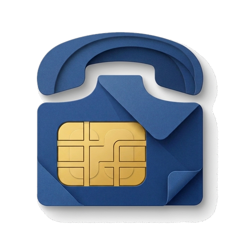
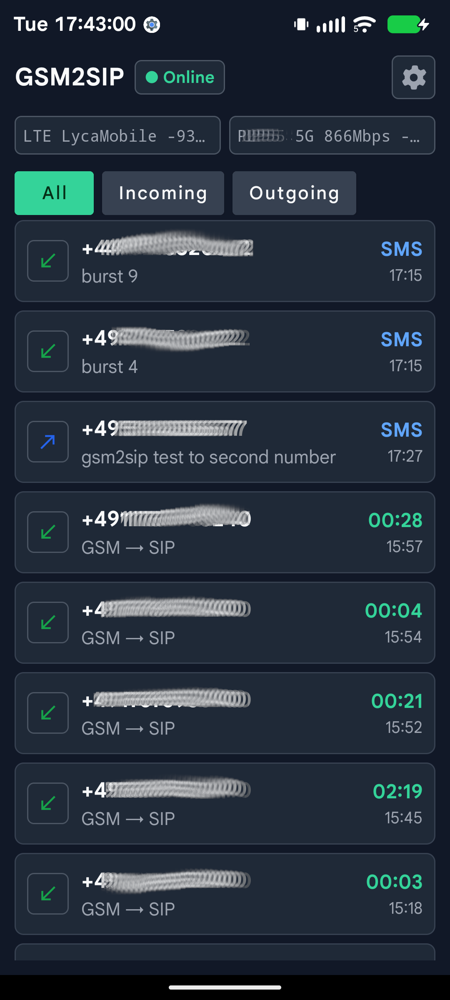
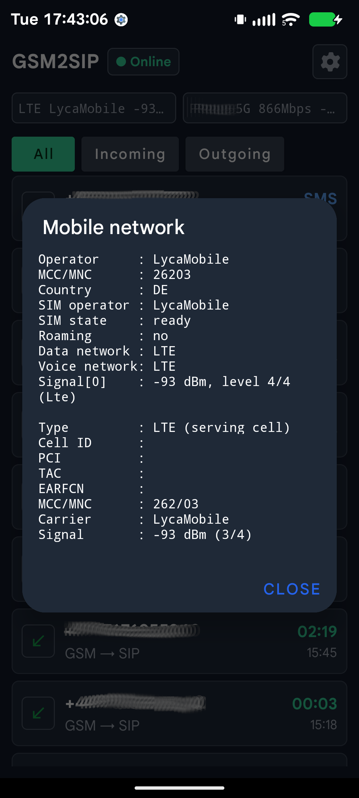

<p align="center">
  
</p>

<h1 align="center">gsm2sip</h1>

<p align="center">
Bridges GSM calls on  Android phone to any SIP server.
</p>

| Calls and messages | Link detail |
|--------|-----------------|
|  |  |

## How It Works

A dedicated rooted Android phone with a local SIM card acts as a SIP-to-GSM gateway:

- **Inbound**: Someone calls the SIM's number → the phone answers → the call is bridged to the SIP server, which routes it wherever the dialplan says (an AI agent, a queue, an extension)
- **Outbound**: the SIP server sends an INVITE with an `X-GSM-Forward: +<number>` header → the phone dials that number over GSM → audio is bridged back to SIP
- **SMS**: messages arriving on any SIM are forwarded to the server as SIP MESSAGE, and the server can ask the gateway to send one and be told what became of it — see [SMS over SIP](#sms-over-sip)

Audio flows through shared speaker/mic — both GSM and SIP audio run concurrently on the same hardware, enabled by a Magisk module that disables Android's audio concurrency restrictions.

## Audio Codec

Selectable in Settings, defaulting to **G.722 only** (wideband, 16 kHz):

| Setting | Offered in SDP |
|---|---|
| G.722 only *(default)* | `9` |
| G.722 preferred, G.711 allowed | `9 8 0` |
| G.711 only | `8 0` |

The default is G.722 alone because offering G.711 alongside it means servers
routinely pick G.711 and every call ends up narrowband regardless of what both
ends support.  Whatever is configured, the app still answers with a codec the
remote actually offered rather than failing a call over a preference.

## Supported Devices

| Device | SoC | Agent → caller | Caller → agent | Status |
|---|---|---|---|---|
| Xiaomi Poco X3 NFC (`surya`) | Qualcomm SM6150/SM7150, WCD9375 | digital, via `incall_music` → `Telephony Tx` | digital, via `VOICE_DOWNLINK` | **fully working** |
| Samsung Galaxy S4 Mini (`serranolte`) | Qualcomm MSM8960, WCD9304 | digital, via `incall_music` | digital, via `VOC_REC_*` | **fully working** |
| Samsung Galaxy S10e | Exynos 9820, CS47L93 | no path | no path | not usable |

**The Poco X3 NFC is the reference device and works fully**: G.722 wideband in
both directions, entirely through the modem, with the handset's own microphone
and speaker muted for the whole call.

**The Galaxy S4 Mini works fully too**, which is worth dwelling on because it
is a 2013 handset on LineageOS 16 (Android 9) and armeabi-v7a — and because its
own vendor configuration claims it cannot.  Its
`audio_policy_configuration.xml` declares no `incall_music_uplink` mixPort and
no Telephony Tx device, and `mixer_paths.xml` has no incall-music path at all,
yet the kernel exposes `Incall_Music Audio Mixer MultiMedia1/2` and
`MultiMedia1 Mixer VOC_REC_DL/UL` regardless.  Read the mixer, not the XML.

It also needs none of the `vsid`/`call_state` announcement the Poco depends
on: its HAL predates that interface entirely, and marks its own voice session
active on `MODE_IN_CALL`, which is exactly what LineageOS fails to do on the
newer HAL.  The older vendor image is an asset here, not a liability.

### Choosing a device

Support is a property of the **vendor image, not the chip**.  Everything the
SM6150 profile relies on — the `incall_music` mixer, the `VOC_REC_*` capture
routing, the `voice_extn` `vsid`/`call_state` interface — is generic Qualcomm
audio, present across the msm8974→sm8xxx HAL family.  What varies is whether
the OEM built the feature in, whether their audio policy exposes a route to the
modem uplink, and which front-end the playback track lands on.  The same SoC
with two different vendor builds can differ, so listing "supported chips" would
be misleading.

Check a candidate instead:

```bash
tools/check-device.sh [adb-serial]
```

The audio-policy check needs no root, so a phone can be vetted before rooting
it.  The HAL and mixer checks need Magisk with Superuser access set to
"Apps and ADB".

What has actually been checked so far:

| Device | SoC | Vendor | Result |
|---|---|---|---|
| Poco X3 NFC | SM6150/SM7150 | Xiaomi (MIUI) | fully working, verified on live calls |
| Galaxy S4 Mini | MSM8960 | LineageOS 16 | fully working, verified on a live call |
| Galaxy S10e | Exynos 9820 | — | no path in either direction |

Everything the working profile depends on is generic Qualcomm audio, so other
Qualcomm phones are plausible candidates — but the deciding factors live in the
vendor image, which is exactly what the script above inspects.  A new device
still needs a `DeviceProfile` entry: the mixer names are generic, the front-end
the playback track lands on is not, and the `Mixer BEFORE/AFTER` lines logged
around each call show which one it is.  An unrecognised Qualcomm device falls
back to `genericQualcomm()`.

Getting digital capture on a Qualcomm device depends on one thing that is easy
to miss.  The HAL gates in-call recording — and the per-session voice mutes —
on `voice_is_call_state_active()`, and on LineageOS that flag is never set:

```
voice_extn: update_call_states is_call_active:0 in_call:1, mode:2
```

`MODE_IN_CALL` is set and the modem's voice session is running, yet every VSID
stays `CALL_INACTIVE`, so `VOICE_CALL`, `VOICE_DOWNLINK` and the `VOC_REC_*`
mixers all return silence.  The app announces the call itself
(`vsid=<hex>;call_state=2`) before opening `AudioRecord`.

The Exynos S10e has no equivalent, and this was confirmed on the hardware
rather than inferred: `audio_policy_configuration.xml` declares three mixPorts
(`deep`, `fast`, `primary`) and no telephony device, and
`audio.primary.universal9820.so` contains no `TELEPHONY_TX`, no `incall_rec`
usecases and no `voice_extn` `call_state`/`vsid` handling.  There is nothing to
inject into and nothing to capture from, so neither direction can be digital.
That is why the gateway moved to a Qualcomm device.

## Requirements

- **Device**: Qualcomm-based Android phone with LineageOS + Magisk root
  (developed against a Poco X3 NFC on Android 16)
- **SIM**: SIM card with voice plan
- **Network**: Stable WiFi connection
- **Power**: Always connected to charger
- **Build host**: Linux with JDK 17+

## Build

```bash
chmod +x build.sh
./build.sh          # debug build
./build.sh release  # release build
```

Outputs:
- `gateway-magisk.zip` — Magisk module containing the APK, permissions, and audio tools (tinymix, tinycap). This is the only file you need to install.

The APK itself is architecture-independent, but `tinymix` is not: the ALSA
control ioctls encode the size of structs containing `long`, so an arm64 build
and an armeabi-v7a build speak different ioctl ABIs and neither works on the
other's kernel.  The module ships both and `install.sh` picks the matching one
at flash time.  Getting this wrong fails quietly rather than loudly — the wrong
binary is still marked executable, so it looks present while every mixer
command dies with `not executable: 64-bit ELF file`.

## Device Setup

Only the Magisk module needs to be installed — it includes the APK and handles all permissions automatically.

1. **Install Magisk module**: Copy `gateway-magisk.zip` to device, install via Magisk Manager → Modules
2. **Reboot** the device — the module installs the APK as a privileged system app and grants all permissions on boot
3. **Set as default phone app**: Settings → Apps → Default apps → Phone app → gsm2sip
4. **Configure SIP**: open Settings in the app (the gear, top right) and enter
   your SIP server address, port, username and password
5. **Own Number**: Enter the SIM's own number in international format, e.g.
   `+4915112345678`.  This is sent as the SIP destination so the server can
   route on the number that was dialled, the same way a VoIP router sends the
   DID.  Leaving it unset makes the gateway address its own extension,
   which most servers route straight back to the device — the call then loops
   and the GSM leg is never answered.
6. **Start**: the gateway registers and begins bridging calls; the header pill
   shows **Online** once registration succeeds (tap it to retry)

### What the SIP leg carries

- **Request-URI / To** — the number that was dialled, i.e. the gateway SIM's
  MSISDN.  Not the SIP account name.
- **From** — the calling party, passed through exactly as the carrier delivered
  it (some send `+49…`, some `0…`; the app does not rewrite it).

Whatever the server routes on, it has to recognise the SIM's number: the
gateway puts that number in the Request-URI, so a dialplan or number table
keyed on it is what decides where the call goes.

## Quick start with callagent.pro

Once installed, you can use gsm2sip instantly with a free
[callagent.pro](https://callagent.pro) registration. The account is a SIP
server that already knows how this gateway addresses calls and messages, so
there is nothing to write on the server side:

1. Register at [callagent.pro](https://callagent.pro) and create an extension.
2. Open the gateway's **Settings** and fill in the server, extension and
   password, plus the SIM's own number under **Own Number**.
3. Save. The gateway registers, and calls to the SIM reach your agent.

## The longer way: your own Asterisk

The gateway is server-agnostic — it registers like any SIP client — so you can
point it at a server you run instead. What follows is one worked example,
using Asterisk (chan_sip) to route inbound GSM calls to an AI agent. Adapt it
to whatever your server does.

It addresses calls the way a VoIP router does: the Request-URI carries the
SIM's number and `From` carries the calling party. That shapes the config
below in two ways — the extension to match is the SIM's MSISDN in E.164, so
the pattern has to accept the leading `+`, and the From user is no longer the
account name, so the peer has to be recognised by the address it registered
from rather than by who the INVITE says it is.

### 1. Create a SIP account for the gateway

Add to `sip.conf` or create via the realtime database:

```ini
[gateway-gw1](agent-template)
type = friend
host = dynamic
secret = <strong-password>
context = gateway-incoming
; From carries the GSM caller, not "gateway-gw1".  If chan_sip then logs "no
; matching peer" for the caller's number, this makes it match on the address
; the gateway registered from instead.
insecure = port,invite
; The gateway offers G.722 only unless Settings → Codec says otherwise.
disallow = all
allow = g722
```

### 2. Add gateway dialplan context

Add to `extensions.conf`:

```ini
; Gateway incoming calls (GSM → SIP → Agent)
; EXTEN is the SIM's own number in international format, e.g. +4915112345678
; — the leading "+" is why this is _+X. and not _X.
[gateway-incoming]
exten => _+X.,1,NoOp(GSM call for ${EXTEN} from ${CALLERID(num)})
same => n,Set(CDR(destination)=${EXTEN})
same => n,Set(CDR(userfield)=gateway-gw1)
; Route on the number that was dialled, the way a DID is routed — one server,
; several gateway SIMs, each landing on its own agent.
same => n,Set(AgentToUse=${ODBC_AGENT_LOOKUP(${EXTEN})})
same => n,GotoIf($["${AgentToUse}" = ""]?default_agent:route_to_agent)
same => n(route_to_agent),MixMonitor(/var/spool/asterisk/monitor/${STRFTIME(${EPOCH},,%Y%m%d-%H%M%S)}-${UNIQUEID}.wav)
same => n,Dial(SIP/${AgentToUse},60,tT)
same => n,Hangup()
same => n(default_agent),MixMonitor(/var/spool/asterisk/monitor/${STRFTIME(${EPOCH},,%Y%m%d-%H%M%S)}-${UNIQUEID}.wav)
same => n,Dial(SIP/100,60,tT)
same => n,Hangup()
```

`${CALLERID(num)}` is the GSM caller, passed through as the carrier delivered
it — some carriers send `+49…`, some `0…`, and the gateway rewrites neither.
Normalise it before any lookup that keys on the caller.

### 3. Making outbound calls through the gateway

Address the call the same way you would address a message: put the number in
the Request-URI and dial the peer.

```ini
exten => _X.,1,NoOp(Outbound via GSM gateway: ${EXTEN})
same => n,Dial(SIP/gateway-gw1/${EXTEN},60)
same => n,Hangup()
```

`X-GSM-Forward` does the same job and takes precedence where both are present,
which is what a dialplan needs when the number it dials is not the number it
wants called:

```ini
same => n,SIPAddHeader(X-GSM-Forward: ${EXTEN})
same => n,Dial(SIP/gateway-gw1,60)
```

The user part of the Request-URI is only read as a destination when it is one:
the account name and the SIM's own number are both ignored, since dialling
either would be a loop, and so is anything that is not a bare number. Under
`chan_pjsip`, note that `SIPAddHeader()` is silently a no-op — the header form
there is `Set(PJSIP_HEADER(add,X-GSM-Forward)=${EXTEN})`.

Allow enough time in `Dial()` for GSM setup — 60s is comfortable, 20s is not.

## Call status codes

What the gateway answers with is a property of the gateway, not of any one
server, so this holds whichever server you point it at. It reports progress
and failure the way a provider does — on Asterisk that means the dialplan can
branch on `${DIALSTATUS}` and `${HANGUPCAUSE}` instead of guessing.

### Outbound — the server asks the gateway to dial

| Situation | Response |
| --- | --- |
| INVITE received | `100 Trying` |
| Dialling the SIM | `180 Ringing` |
| The mobile answered | `200 OK`, then RTP |
| Callee busy | `486 Busy Here` |
| Callee declined | `603 Decline` |
| No answer, or unreachable | `480 Temporarily Unavailable` |
| Cancelled at the handset | `487 Request Terminated` |
| Number barred | `403 Forbidden` |
| Gateway already on a call | `486 Busy Here` |
| No destination in the INVITE | `488 Not Acceptable Here` |
| Anything failing after the answer | `BYE` |

The `180` carries no SDP, deliberately. Without an SDP answer the server
cannot open an early-media path, so an agent cannot be bridged into a call the
mobile has not picked up yet — if you ever hear the agent start talking before
you answer, something other than this gateway put it there. `183 Session
Progress` is never sent for that reason.

A `488` means the INVITE named no number the gateway could dial — neither an
`X-GSM-Forward` header nor a usable Request-URI. Under `chan_sip` that usually
means `SIPAddHeader()` ran on a different channel than the one that was
dialled; under `chan_pjsip` it means `SIPAddHeader()` ran at all.

Only a call the gateway answered is ended with `BYE`. One that never connected
is turned down with the final response above, which is the only place the
server learns why the GSM leg did not come up — a `BYE` for an unanswered
INVITE is not valid, and a server that gets one replies `481` and then sits
out its own timer, which makes every failure look alike and look like a
timeout.

### Inbound — the SIM rings and the gateway calls the server

Here the gateway is the caller, so these are the responses it acts on. It
places the INVITE while the GSM leg is still ringing and answers the GSM call
only once the server sends `200 OK`, so the caller hears normal ringing until
the agent is actually on the line, with no dead air at the join.

| Server sends | Gateway does |
| --- | --- |
| `100` / `180` / `183` | Keeps the GSM leg ringing |
| `200 OK` | Answers the GSM call and starts the bridge |
| `486` / `603` / any 4xx-6xx | Ends the GSM call |
| No response | Retries, then gives up and ends the GSM call |

## SMS over SIP

Messages travel as page-mode SIP MESSAGE (RFC 3428) over the registration that
is already up for calls — no second connection, no extra port, nothing for the
server to reach through the NAT.

The gateway does **not** take the default-SMS-app role. Receiving works through
`SMS_RECEIVED`, which reaches any app holding `RECEIVE_SMS`, and sending needs
only `SEND_SMS`; the role exists to *store* messages, which a gateway has no
reason to do. Both permissions are granted by the Magisk module, and the app
re-grants them over root at bring-up if they are missing.

### Received SMS → server

One MESSAGE per message, already reassembled from its parts:

```
MESSAGE sip:+4915112345678@example.com SIP/2.0
From: <sip:+4917098765432@example.com>;tag=gw123456789
To: <sip:+4915112345678@example.com>
X-SMS-Id: 550e8400-e29b-41d4-a716-446655440000
X-SMS-From: +4917098765432
X-SMS-To: +4915112345678
X-SMS-Received: 2026-09-08T16:20:31Z
X-SMS-Parts: 1
X-SMS-Sim-Sub: 1
X-SMS-Sim-Slot: 1
X-SMS-Sim-Carrier: ExampleMobile
Content-Type: text/plain;charset=UTF-8

Hello from a mobile
```

The Request-URI is the receiving SIM's own number, so an SMS presents the same
routing key an inbound call does. `X-SMS-Id` is the idempotency key: answer
`200` or `202` and the message is done, answer anything else — or nothing — and
the same id is retried every 30s until it lands. A message that arrives while
SIP is down is written to disk and sent when registration returns.

### Server → SMS

```
MESSAGE sip:+4917098765432@example.com SIP/2.0
X-SMS-Id: 0ca1c8ad-27e1-4c9e-b6b4-41abca9805d3
X-SMS-Sim-Slot: 1
Content-Type: text/plain;charset=UTF-8

Reply from the agent
```

The recipient is the Request-URI user, or `X-SMS-To` if you would rather keep
the URI generic. `X-SMS-Sim-Slot` (or `X-SMS-Sim-Sub`) picks the SIM — a
dual-SIM gateway has no meaningful default, since a reply has to leave by the
SIM the conversation is on.

The response says what the message will cost before you commit to the text:

```
SIP/2.0 202 Accepted
X-SMS-Parts: 1
X-SMS-Encoding: GSM7
```

**Only `202` is a promise.** `400` missing recipient or body, `415` body is not
`text/plain`, `503` `SEND_SMS` not granted (retry later), `405` SMS handling
unavailable — none of those queued anything. A repeat carrying an id already
held is answered `202` and not sent again.

One character outside GSM-7 forces the whole message to UCS-2, which cuts a
part from 160 characters to 70: an 88-character reply is one part in plain
ASCII and two with a single em dash in it. `X-SMS-Encoding` is how a sender
finds that out in time to do something about it.

### Delivery reports

Two reports come back, each a MESSAGE addressed to the SIM's own number — so
they arrive in the same context as an inbound SMS, and `X-SMS-Event` is what
tells them apart.

```
X-SMS-Id: 0ca1c8ad-27e1-4c9e-b6b4-41abca9805d3
X-SMS-Event: submitted
X-SMS-To: +4917098765432
X-SMS-Parts: 1
X-SMS-At: 2026-09-08T16:56:09Z
Content-Type: text/plain;charset=UTF-8

{"id":"0ca1c8ad-…","event":"submitted","to":"+4917098765432","parts":1,
 "sentOk":1,"sentFailed":0,"deliveredOk":0,"deliveredFailed":0,
 "at":"2026-09-08T16:56:09Z"}
```

| `X-SMS-Event` | meaning | more follows? |
|---|---|---|
| `submitted` | the network accepted it | yes — a delivery result |
| `failed` | the network refused it; see `X-SMS-Reason` | no, terminal |
| `delivered` | the SMSC confirmed it reached the handset | no, terminal |
| `undelivered` | the SMSC reported permanent failure | no, terminal |

`X-SMS-Reason` names the failure rather than numbering it — `no_service`,
`radio_off`, `limit_exceeded`, or the RIL code paired with the network's own
cause, e.g. `modem_err/facility_rejected` when the carrier refuses the
submission. `X-SMS-Status` carries the SMSC's status value, or `unknown` when
the report arrived without a readable PDU, so an inferred result never looks
like a stated one.

Reports are retried like anything else: answer `200`/`202`, or the gateway
sends them again, including after the next registration.

### Asterisk (chan_sip)

Out-of-call MESSAGEs are off by default, and they arrive on the same peer the
calls use — `[gateway-gw1]` from the call example above needs nothing added.

```ini
; sip.conf
[general]
accept_outofcall_message=yes
outofcall_message_context=messages
auth_message_requests=yes
```

#### Receiving: SMS and delivery reports

Both arrive addressed to the SIM's own number, so one context handles them and
`X-SMS-Event` is what separates a message from a report on something we sent.

```ini
; extensions.conf — exten is the Request-URI user, i.e. the SIM's number
[messages]
exten => _+X.,1,NoOp(${MESSAGE(from)} -> ${MESSAGE(to)})
 same => n,Set(ID=${SIP_HEADER(X-SMS-Id)})
 same => n,Set(EVENT=${SIP_HEADER(X-SMS-Event)})
 same => n,GotoIf($["${EVENT}" != ""]?report)

; A received SMS.  CALLERID(num) is the sender, MESSAGE(body) the reassembled
; text; X-SMS-Sim-Slot says which SIM took it, which is the slot a reply has
; to leave by.
 same => n,Set(SLOT=${SIP_HEADER(X-SMS-Sim-Slot)})
 same => n,AGI(sms_in.agi,${ID},${CALLERID(num)},${MESSAGE(to)},${SLOT},${MESSAGE(body)})
 same => n,Hangup()

; A report on something we asked the gateway to send.  ID is the same id the
; send carried, so it matches the report back to the message.
 same => n(report),Set(STATUS=${SIP_HEADER(X-SMS-Status)})
 same => n,Set(REASON=${SIP_HEADER(X-SMS-Reason)})
 same => n,AGI(sms_status.agi,${ID},${EVENT},${STATUS},${REASON})
 same => n,Hangup()
```

`submitted` is not the end of the story — a `delivered` or `undelivered`
follows it — so a handler that closes the message out on the first report
closes it too early. `failed` and `delivered`/`undelivered` are terminal.

#### Sending

`MessageSend()` addresses the peer, so the Request-URI it builds carries the
account name, not the recipient. The gateway reads `X-SMS-To` first and falls
back to the Request-URI, so the recipient goes in that header:

```ini
; extensions.conf — Gosub(sms-out,s,1(+4917098765432,Reply from the agent))
[sms-out]
exten => s,1,NoOp(SMS to ${ARG1})
 same => n,Set(MESSAGE(body)=${ARG2})
 same => n,Set(MESSAGE(custom_data)=mark_all_outbound)
 same => n,Set(MESSAGE_DATA(X-SMS-To)=${ARG1})
; Our own id, so the delivery reports can be matched back to this send.  Omit
; it and the gateway mints one, which arrives only in the reports.
 same => n,Set(MESSAGE_DATA(X-SMS-Id)=${UNIQUEID})
; Only needed on a dual-SIM gateway — the slot the conversation is on.
 same => n,Set(MESSAGE_DATA(X-SMS-Sim-Slot)=1)
; Second argument is who it is from, as the server sees it — the gateway does
; not read it, but it is what lands in the CDR.
 same => n,MessageSend(sip:gateway-gw1,sip:agent@example.com)
 same => n,NoOp(send status: ${MESSAGE_SEND_STATUS})
 same => n,Return()
```

`MESSAGE_SEND_STATUS` is `SUCCESS` for the `202`, which means the gateway has
the message on disk and owns delivering it — not that it reached anyone. What
it cost comes back as `X-SMS-Parts` and `X-SMS-Encoding` on that `202`, and
Asterisk does not expose response headers to the dialplan, so a sender that
cares about part count has to measure the text itself: one character outside
GSM-7 takes the whole message to UCS-2 and 70 characters a part.

Nothing above is dialplan-only — AMI's `MessageSend` action and ARI's
`POST /endpoints/sendMessage` take the same body and variables.

#### chan_sip specifics worth knowing

It emits the `202` for a received message itself, before the dialplan runs, so
a dialplan failure will not make the gateway retry — write durably early and
dedupe on `X-SMS-Id`. An unmatched extension returns `404`, which the gateway
reads as not-accepted and retries every 30s, so make sure the pattern covers
the SIM's number format. And if your build does not carry `MESSAGE_DATA()`
headers outbound, sends still work: the gateway mints its own id and uses the
default SIM, and only `X-SMS-To` is genuinely required.

Carriers also rate-limit SMS independently of anything here: a run of sends can
end in `modem_err/facility_rejected` for every destination, including the SIM's
own number, until the allowance resets.

## Architecture

```
┌─────────────────┐     GSM      ┌──────────────────┐
│  Remote Caller   │◄───────────►│  Android Phone    │
│  (local #)       │   voice     │  (Poco X3 + SIM)  │
└─────────────────┘              │                    │
                                 │  ┌──────────────┐ │
                                 │  │ InCallService │ │  GSM call control
                                 │  └──────┬───────┘ │
                                 │         │         │
                                 │  ┌──────▼───────┐ │
                                 │  │ Orchestrator  │ │  Bridges GSM ↔ SIP
                                 │  └──────┬───────┘ │
                                 │         │         │
                                 │  ┌──────▼───────┐ │
                                 │  │  SIP Client   │ │  Registration + calls
                                 │  │  RTP Session  │ │  G.722 audio stream
                                 │  └──────┬───────┘ │
                                 └─────────┼─────────┘
                                           │ SIP/RTP
                                           │ (WiFi)
                                 ┌─────────▼─────────┐
                                 │    SIP Server      │
                                 │  (Asterisk, etc.)  │
                                 └─────────┬─────────┘
                                           │
                                 ┌─────────▼─────────┐
                                 │ Agent / queue /   │
                                 │ extension         │
                                 └───────────────────┘
```

## Magisk Module

The `gateway-magisk.zip` module does two critical things:

1. **Disables audio concurrency restrictions** (`system.prop`):
   - `voice.voip.conc.disabled=false` — allows VoIP audio during GSM calls
   - `voice.record.conc.disabled=false` — allows audio recording during calls
   - `voice.playback.conc.disabled=false` — allows audio playback during calls

2. **Grants system-level permissions** (`privapp-permissions-gateway.xml`):
   - `CAPTURE_AUDIO_OUTPUT` — capture audio from other sources
   - `MODIFY_PHONE_STATE` — control telephony
   - `READ_PRECISE_PHONE_STATE` — detailed call state info

## Troubleshooting

- **Agent hears silence**: the foreground service must be started while an
  Activity is visible. Android 12+ withholds `PROCESS_CAPABILITY_FOREGROUND_MICROPHONE`
  from a service started in the background, and AudioPolicy then feeds
  `AudioRecord` zeros without any error (`rec update ... silenced` in
  `dumpsys audio`). The module launches the UI on boot for this reason.
- **Agent hears itself / heavy noise**: capture must use `VOICE_DOWNLINK`, not
  `VOICE_CALL`. The latter mixes uplink and downlink, and the uplink carries
  the injected agent audio.
- **Caller hears the room or their own echo**: the phone's mic is in the GSM
  uplink. Muting it only works through `AudioManager` — the ALSA voice mutes
  are rewritten by the HAL, and they are 3-element arrays
  (`{mute, session_vsid, ramp_ms}`), so a single-value `tinymix` write silently
  does nothing.
- **Calls loop back and never answer**: the Own Number setting is unset, so the
  gateway is INVITEing its own extension.
- **One-way audio**: Ensure the Magisk module is installed and device is rebooted
- **Echo**: The app uses Android's AcousticEchoCanceler + VOICE_COMMUNICATION mode
- **SIP not registering**: Check WiFi connectivity, server address, and credentials
- **Calls not auto-answering**: Ensure the app is set as the default phone app
- **Audio drops**: Check WiFi stability; the app holds a WiFi lock but poor signal will cause issues
