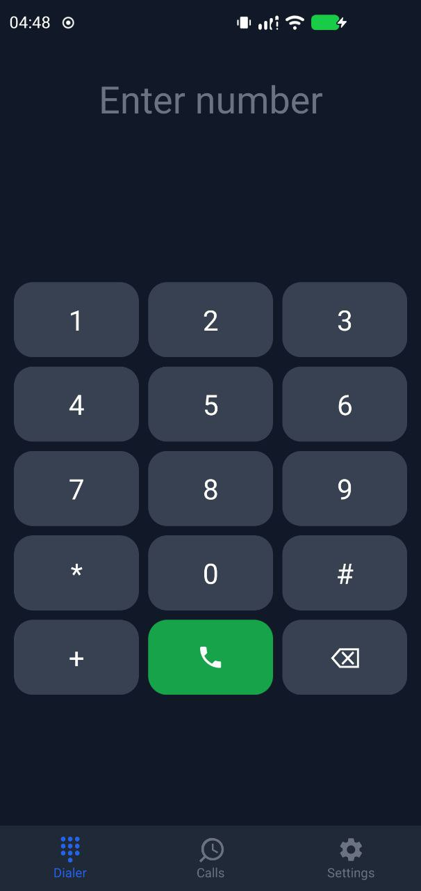
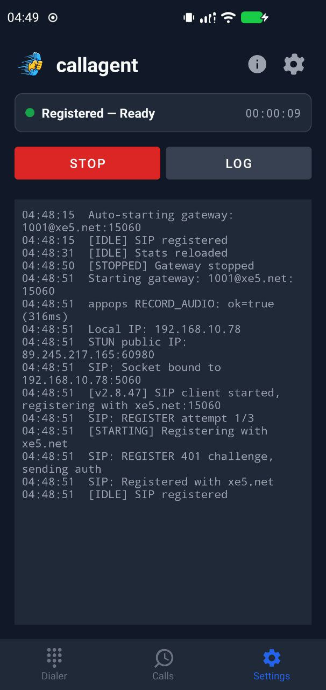

<p align="center">
  
</p>

<h1 align="center">gsm2sip</h1>

<p align="center">
Bridges GSM calls on an Android phone's SIM to any SIP server.
Server, port, credentials and codec are configured in the app.
</p>

| Dialer | SIP Registration |
|--------|-----------------|
|  |  |

## How It Works

A dedicated rooted Android phone with a local SIM card acts as a SIP-to-GSM gateway:

- **Inbound**: Someone calls the SIM's number → the phone answers → the call is bridged to the SIP server, which routes it wherever the dialplan says (an AI agent, a queue, an extension)
- **Outbound**: the SIP server sends an INVITE with an `X-GSM-Forward: +<number>` header → the phone dials that number over GSM → audio is bridged back to SIP

Audio flows through shared speaker/mic — both GSM and SIP audio run concurrently on the same hardware, enabled by a Magisk module that disables Android's audio concurrency restrictions.

## Audio Codec

Selectable in Settings, defaulting to **G.722 only** (wideband, 16 kHz):

| Setting | Offered in SDP |
|---|---|
| G.722 only *(default)* | `9` |
| G.722 preferred, G.711 allowed | `9 8 0` |
| G.711 only | `8 0` |

The default is G.722 alone because offering G.711 alongside it means servers
routinely pick G.711 and every call ends up narrowband regardless of what both
ends support.  Whatever is configured, the app still answers with a codec the
remote actually offered rather than failing a call over a preference.

## Supported Devices

| Device | SoC | Agent → caller | Caller → agent | Status |
|---|---|---|---|---|
| Xiaomi Poco X3 NFC (`surya`) | Qualcomm SM6150/SM7150, WCD9375 | digital, via `incall_music` → `Telephony Tx` | digital, via `VOICE_DOWNLINK` | **fully working** |
| Samsung Galaxy S4 Mini | Qualcomm MSM8930, WCD9304 | digital, via `incall_music` | acoustic (mic hears the speaker) | partial |
| Samsung Galaxy S10e | Exynos 9820, CS47L93 | no path | no path | not usable |

**The Poco X3 NFC is the reference device and works fully**: G.722 wideband in
both directions, entirely through the modem, with the handset's own microphone
and speaker muted for the whole call.

### Choosing a device

Support is a property of the **vendor image, not the chip**.  Everything the
SM6150 profile relies on — the `incall_music` mixer, the `VOC_REC_*` capture
routing, the `voice_extn` `vsid`/`call_state` interface — is generic Qualcomm
audio, present across the msm8974→sm8xxx HAL family.  What varies is whether
the OEM built the feature in, whether their audio policy exposes a route to the
modem uplink, and which front-end the playback track lands on.  The same SoC
with two different vendor builds can differ, so listing "supported chips" would
be misleading.

Check a candidate instead:

```bash
tools/check-device.sh [adb-serial]
```

The audio-policy check needs no root, so a phone can be vetted before rooting
it.  The HAL and mixer checks need Magisk with Superuser access set to
"Apps and ADB".

What has actually been checked so far:

| Device | SoC | Vendor | Result |
|---|---|---|---|
| Poco X3 NFC | SM6150/SM7150 | Xiaomi (MIUI) | fully working, verified on live calls |
| Galaxy S4 Mini | MSM8930 | — | `incall_music` present; digital capture untested |
| Galaxy S10e | Exynos 9820 | — | no path in either direction |

Everything the working profile depends on is generic Qualcomm audio, so other
Qualcomm phones are plausible candidates — but the deciding factors live in the
vendor image, which is exactly what the script above inspects.  A new device
still needs a `DeviceProfile` entry: the mixer names are generic, the front-end
the playback track lands on is not, and the `Mixer BEFORE/AFTER` lines logged
around each call show which one it is.  An unrecognised Qualcomm device falls
back to `genericQualcomm()`.

Getting digital capture on a Qualcomm device depends on one thing that is easy
to miss.  The HAL gates in-call recording — and the per-session voice mutes —
on `voice_is_call_state_active()`, and on LineageOS that flag is never set:

```
voice_extn: update_call_states is_call_active:0 in_call:1, mode:2
```

`MODE_IN_CALL` is set and the modem's voice session is running, yet every VSID
stays `CALL_INACTIVE`, so `VOICE_CALL`, `VOICE_DOWNLINK` and the `VOC_REC_*`
mixers all return silence.  The app announces the call itself
(`vsid=<hex>;call_state=2`) before opening `AudioRecord`.

The Exynos S10e has no equivalent, and this was confirmed on the hardware
rather than inferred: `audio_policy_configuration.xml` declares three mixPorts
(`deep`, `fast`, `primary`) and no telephony device, and
`audio.primary.universal9820.so` contains no `TELEPHONY_TX`, no `incall_rec`
usecases and no `voice_extn` `call_state`/`vsid` handling.  There is nothing to
inject into and nothing to capture from, so neither direction can be digital.
That is why the gateway moved to a Qualcomm device.

## Requirements

- **Device**: Qualcomm-based Android phone with LineageOS + Magisk root
  (developed against a Poco X3 NFC on Android 16)
- **SIM**: SIM card with voice plan
- **Network**: Stable WiFi connection
- **Power**: Always connected to charger
- **Build host**: Linux with JDK 17+

## Build

```bash
chmod +x build.sh
./build.sh          # debug build
./build.sh release  # release build
```

Outputs:
- `gateway-magisk.zip` — Magisk module containing the APK, permissions, and audio tools (tinymix, tinycap). This is the only file you need to install.

## Device Setup

Only the Magisk module needs to be installed — it includes the APK and handles all permissions automatically.

1. **Install Magisk module**: Copy `gateway-magisk.zip` to device, install via Magisk Manager → Modules
2. **Reboot** the device — the module installs the APK as a privileged system app and grants all permissions on boot
3. **Set as default phone app**: Settings → Apps → Default apps → Phone app → gsm2sip
4. **Configure SIP**: open Settings in the app (the gear, top right) and enter
   your SIP server address, port, username and password
5. **Own Number**: Enter the SIM's own number in international format, e.g.
   `+4915215320372`.  This is sent as the SIP destination so the server can
   route on the number that was dialled, the same way a VoIP router sends the
   DID.  Leaving it unset makes the gateway address its own extension,
   which most servers route straight back to the device — the call then loops
   and the GSM leg is never answered.
6. **Start**: the gateway registers and begins bridging calls; the header pill
   shows **Online** once registration succeeds (tap it to retry)

### What the SIP leg carries

- **Request-URI / To** — the number that was dialled, i.e. the gateway SIM's
  MSISDN.  Not the SIP account name.
- **From** — the calling party, passed through exactly as the carrier delivered
  it (some send `+49…`, some `0…`; the app does not rewrite it).

Whatever the server routes on, it has to recognise the SIM's number: the
gateway puts that number in the Request-URI, so a dialplan or number table
keyed on it is what decides where the call goes.

## Asterisk Configuration (example)

The gateway itself is server-agnostic — it registers like any SIP client. What
follows is one worked example, using Asterisk to route inbound GSM calls to an
AI agent. Adapt it to whatever your server does.

### 1. Create a SIP account for the gateway

Add to `sip.conf` or create via the realtime database:

```ini
[gateway-gw1](agent-template)
secret = <strong-password>
context = gateway-incoming
```

### 2. Add gateway dialplan context

Add to `extensions.conf`:

```ini
; Gateway incoming calls (GSM → SIP → Agent)
[gateway-incoming]
exten => _X.,1,NoOp(Gateway call from ${CALLERID(num)} via GSM SIM)
same => n,Set(CDR(destination)=${EXTEN})
same => n,Set(CDR(userfield)=gateway-gw1)
; Route to AI agent (same logic as incoming-calls)
same => n,Set(AgentToUse=${ODBC_AGENT_LOOKUP(gateway-gw1)})
same => n,GotoIf($["${AgentToUse}" = ""]?default_agent:route_to_agent)
same => n(route_to_agent),MixMonitor(/var/spool/asterisk/monitor/${STRFTIME(${EPOCH},,%Y%m%d-%H%M%S)}-${UNIQUEID}.wav)
same => n,Dial(SIP/${AgentToUse},60,tT)
same => n,Hangup()
same => n(default_agent),MixMonitor(/var/spool/asterisk/monitor/${STRFTIME(${EPOCH},,%Y%m%d-%H%M%S)}-${UNIQUEID}.wav)
same => n,Dial(SIP/100,60,tT)
same => n,Hangup()

; Outbound: Agent calls a number via the gateway
; The agent context already allows outbound calls:
;   Dial(SIP/gateway-gw1,,X-GSM-Forward: +1234567890)
; Or use a custom AGI/ARI to set the header.
```

### 3. Making outbound calls through the gateway

From Asterisk dialplan, to call a number via the gateway:

```ini
exten => _X.,1,NoOp(Outbound via GSM gateway: ${EXTEN})
same => n,SIPAddHeader(X-GSM-Forward: +${EXTEN})
same => n,Dial(SIP/gateway-gw1,60)
same => n,Hangup()
```

## Architecture

```
┌─────────────────┐     GSM      ┌──────────────────┐
│  Remote Caller   │◄───────────►│  Android Phone    │
│  (local #)       │   voice     │  (Poco X3 + SIM)  │
└─────────────────┘              │                    │
                                 │  ┌──────────────┐ │
                                 │  │ InCallService │ │  GSM call control
                                 │  └──────┬───────┘ │
                                 │         │         │
                                 │  ┌──────▼───────┐ │
                                 │  │ Orchestrator  │ │  Bridges GSM ↔ SIP
                                 │  └──────┬───────┘ │
                                 │         │         │
                                 │  ┌──────▼───────┐ │
                                 │  │  SIP Client   │ │  Registration + calls
                                 │  │  RTP Session  │ │  G.722 audio stream
                                 │  └──────┬───────┘ │
                                 └─────────┼─────────┘
                                           │ SIP/RTP
                                           │ (WiFi)
                                 ┌─────────▼─────────┐
                                 │    SIP Server      │
                                 │  (Asterisk, etc.)  │
                                 └─────────┬─────────┘
                                           │
                                 ┌─────────▼─────────┐
                                 │ Agent / queue /   │
                                 │ extension         │
                                 └───────────────────┘
```

## Magisk Module

The `gateway-magisk.zip` module does two critical things:

1. **Disables audio concurrency restrictions** (`system.prop`):
   - `voice.voip.conc.disabled=false` — allows VoIP audio during GSM calls
   - `voice.record.conc.disabled=false` — allows audio recording during calls
   - `voice.playback.conc.disabled=false` — allows audio playback during calls

2. **Grants system-level permissions** (`privapp-permissions-gateway.xml`):
   - `CAPTURE_AUDIO_OUTPUT` — capture audio from other sources
   - `MODIFY_PHONE_STATE` — control telephony
   - `READ_PRECISE_PHONE_STATE` — detailed call state info

## Troubleshooting

- **Agent hears silence**: the foreground service must be started while an
  Activity is visible. Android 12+ withholds `PROCESS_CAPABILITY_FOREGROUND_MICROPHONE`
  from a service started in the background, and AudioPolicy then feeds
  `AudioRecord` zeros without any error (`rec update ... silenced` in
  `dumpsys audio`). The module launches the UI on boot for this reason.
- **Agent hears itself / heavy noise**: capture must use `VOICE_DOWNLINK`, not
  `VOICE_CALL`. The latter mixes uplink and downlink, and the uplink carries
  the injected agent audio.
- **Caller hears the room or their own echo**: the phone's mic is in the GSM
  uplink. Muting it only works through `AudioManager` — the ALSA voice mutes
  are rewritten by the HAL, and they are 3-element arrays
  (`{mute, session_vsid, ramp_ms}`), so a single-value `tinymix` write silently
  does nothing.
- **Calls loop back and never answer**: the Own Number setting is unset, so the
  gateway is INVITEing its own extension.
- **One-way audio**: Ensure the Magisk module is installed and device is rebooted
- **Echo**: The app uses Android's AcousticEchoCanceler + VOICE_COMMUNICATION mode
- **SIP not registering**: Check WiFi connectivity, server address, and credentials
- **Calls not auto-answering**: Ensure the app is set as the default phone app
- **Audio drops**: Check WiFi stability; the app holds a WiFi lock but poor signal will cause issues
